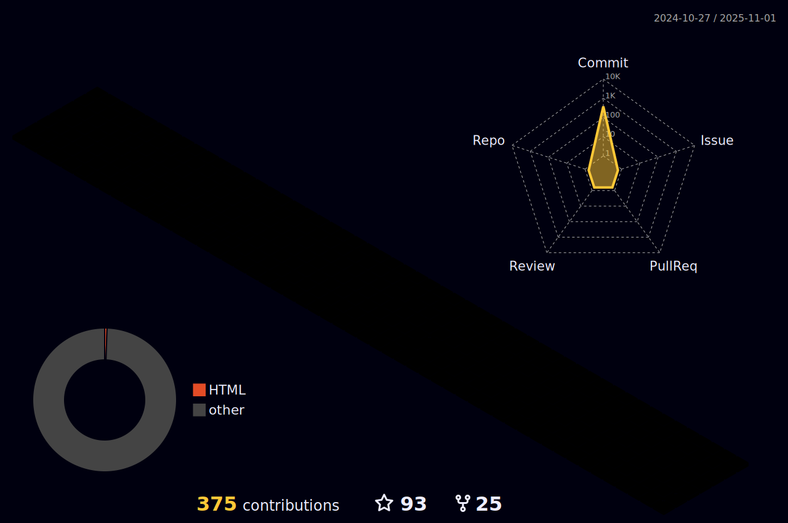

# [](https://git.io/typing-svg)
```
class TcDhlPro():
     def __init__(self):
         self.me = {
             "编程境界": "练气期一层",
             "主修心法": "Python",
             "辅修心法_1": "",
             "武学技能_1":"Flask",
             "武学技能_2":"PySide",
             "武学技能_3":"Mysql",
             "武器法宝_1":"VsCode"
         }
```
<div align="center">

</div>

# 🧰 语言工具:
<a href="https://devicon.dev/" target="_blank">  </a>
<a>  </a>
<a>  </a>
<a >  </a>
<a>  </a>
<a>  </a>
<a>  </a>
<a>  </a>
<a>  </a>
<a>  </a>
<a>  </a>
<a>  </a>
<a>  </a>
<a>  </a>

# 🚀 GitHub Stats:
<details open>
<summary>点击展开 ...</summary>

[](https://github-readme-stats.08w80.com)

[](https://github-readme-stats.08w80.com)

[](https://git.io/streak-stats)

[](https://github.com/TcDhlPro)

[](https://github.com/ashutosh00710/github-readme-activity-graph)

[](https://agent-github.08w80.com/gh/TcDhlPro/TcDhlPro/profile-3d-contrib/profile-night-rainbow.svg)

# 💻 仓库
|                        Project                         |                            Stars                              |                            Forks                             |              Remark              |
| :---------------------------------------------------- | :----------------------------------------------------------: | :----------------------------------------------------------: | :------------------------------: |
| [[1]TcDhlPro-TelegramBot](https://github.com/TcDhlPro/TcDhlPro-TelegramBot) |  |  | Telegram入群验证机器人。 |
| [[2]tcdhlpro.github.io](https://github.com/TcDhlPro/tcdhlpro.github.io) |  |  | Github资源加速访问。 |
| [[3]SelfHostingNetworkControllers](https://github.com/TcDhlPro/ZeroTierOne-SelfHostingNetworkControllers-ZtnCui/tree/main) |  |  | 依照ZeroTierOne官方提供的Api<br>使用key-networks/ztncui提供的控制器,搭建私有根服务端<br>客户端数量解锁无限制 |
| [[4]PySide6_ChatGPTools](https://github.com/TcDhlPro/PySide6_ChatGPTools) |  |  | 基于OpenAI的API, 实现上下文关联的ChatGPT对话工具 |

---
[](https://visitor-badge.laobi.icu/badge?page_id=TcDhlPro.TcDhlPro)

## 💰 You can help me by Donating
[](https://paypal.me/TcDhlPro) 

  
<!-- Proudly created with GPRM ( https://gprm.itsvg.in ) -->
